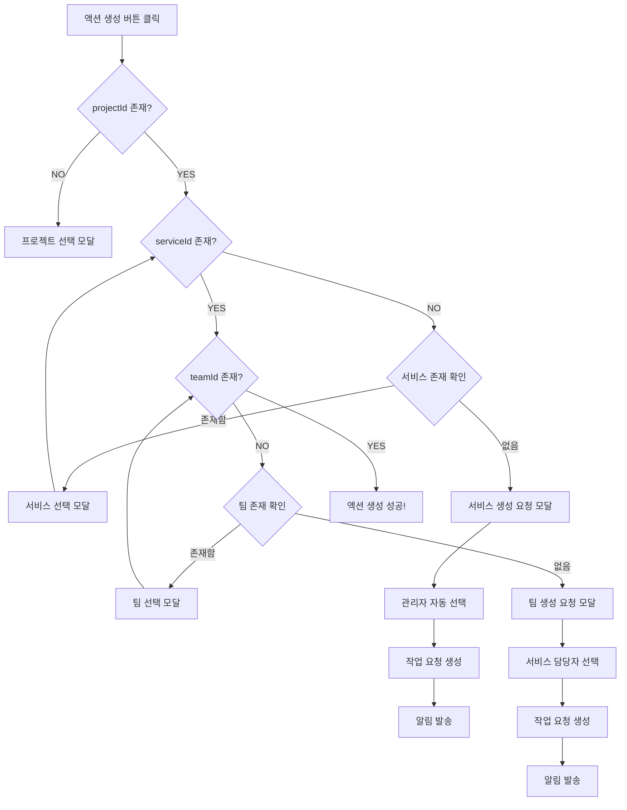

# 계층적 워크플로우 설계서

**버전**: v1.0.0 (설계)
**작성일**: 2025-10-29
**상태**: 설계 단계
**목적**: 작업 요청 시 누락된 계층(서비스/팀)을 자동으로 생성하는 워크플로우

---

## 📋 목차
1. [문제 정의](#1-문제-정의)
2. [해결 방안](#2-해결-방안)
3. [상세 시나리오](#3-상세-시나리오)
4. [기술 구현 요소](#4-기술-구현-요소)
5. [UI/UX 플로우](#5-uiux-플로우)
6. [데이터 모델](#6-데이터-모델)
7. [API 명세](#7-api-명세)
8. [구현 단계](#8-구현-단계)
9. [테스트 시나리오](#9-테스트-시나리오)

---

## 1. 문제 정의

### 현재 상황
- 작업 요청 생성 시 프로젝트만 선택하고 **서비스/팀을 선택하지 않는 경우**
- 담당자가 승인 후 "액션 생성" 시도 시 **팀 ID 누락으로 실패**
- 에러 메시지: `"Team is required to create action"`

### 발생 위치
```typescript
// backend/src/controllers/work-request.controller.ts:726-728
if (!workRequest.teamId) {
  return res.status(400).json({ error: 'Team is required to create action' });
}
```

### 근본 원인
PSTA 계층 구조에서 액션(ACTION)은 반드시 팀(TEAM)의 하위에 생성되어야 하지만,
작업 요청 시 팀까지 선택하지 않은 경우 액션 생성이 불가능함.

---

## 2. 해결 방안

### 핵심 개념
**누락된 계층을 역방향 작업 요청으로 자동 생성**

### 워크플로우 원칙
1. **서비스 없음** → 상위 관리자(PO/PM)에게 서비스 생성 작업 요청
2. **팀 없음** → 서비스 담당자에게 팀 생성 작업 요청
3. **연쇄 요청** → 서비스, 팀 순차적으로 생성
4. **자동 연결** → 생성된 항목을 원본 작업 요청에 자동 링크

### 장점
- ✅ 사용자 친화적: 막히지 않고 계속 진행 가능
- ✅ 자동화: 담당자 자동 선택
- ✅ 추적 가능: 작업 요청 체인으로 히스토리 추적
- ✅ 유연성: 직접 생성 또는 요청 선택 가능
- ✅ 알림 통합: Slack/Telegram 알림 자동 발송

---

## 3. 상세 시나리오

### 시나리오 A: 프로젝트만 있는 경우 (서비스 없음)

**초기 상태**:
```
├── 프로젝트: "2025 현시스템 유지관리"
└── (서비스 없음)
```

#### Step 1: 작업 요청 생성
- 👤 **김철수 (일반 사용자)**
  - 제목: "버그 수정 필요"
  - 프로젝트: "2025 현시스템 유지관리" 선택
  - 서비스: ❌ 선택 안 함
  - 팀: ❌ 선택 안 함
  - 담당자: 이영희 (PM) 할당

#### Step 2: 작업 요청 승인
- 👤 **이영희 (PM)**: 작업 요청 승인
- 💬 시스템 메시지: "승인되었습니다. 액션을 생성해주세요."

#### Step 3: 액션 생성 시도 → 서비스 누락 감지
- 👤 **이영희**: "액션 생성" 버튼 클릭
- 🚨 **시스템 감지**:
  ```javascript
  if (!workRequest.serviceId) {
    showServiceRequiredModal();
  }
  ```

#### Step 3-1: 서비스 생성 요청 모달 표시
```
┌─────────────────────────────────────────────┐
│ ⚠️  서비스가 필요합니다                      │
├─────────────────────────────────────────────┤
│                                             │
│ 이 작업을 수행하려면 서비스가 필요하지만,   │
│ 프로젝트 "2025 현시스템 유지관리"에         │
│ 서비스가 등록되어 있지 않습니다.            │
│                                             │
│ 어떻게 진행하시겠습니까?                     │
│                                             │
│ 선택사항:                                    │
│ ○ 서비스 생성 요청하기 (권장)                │
│   → PO/PM에게 서비스 생성 요청을 보냅니다   │
│                                             │
│ ○ 직접 서비스 생성하기                       │
│   → 권한이 있는 경우에만 가능합니다         │
│                                             │
│         [취소]        [다음 단계로]         │
└─────────────────────────────────────────────┘
```

#### Step 3-2: 서비스 생성 요청 자동 작성
- 🔍 **시스템 로직**:
  ```typescript
  // 1. 담당자 찾기 우선순위
  const manager = await findManager({
    priority: [
      'PROJECT_ASSIGNEE',  // 프로젝트 담당자
      'PO_ROLE',           // PO 권한 사용자
      'PM_ROLE',           // PM 권한 사용자
      'USER_TEAM_LEADER'   // 요청자의 팀장
    ]
  });
  ```

- 📋 **자동 작업 요청 생성 모달**:
  ```
  ┌─────────────────────────────────────────────┐
  │ 📬 서비스 생성 작업 요청                     │
  ├─────────────────────────────────────────────┤
  │                                             │
  │ 제목:                                        │
  │ ┌─────────────────────────────────────────┐ │
  │ │ [자동] 2025 현시스템 유지관리           │ │
  │ │       - 서비스 생성 필요                │ │
  │ └─────────────────────────────────────────┘ │
  │                                             │
  │ 설명:                                        │
  │ ┌─────────────────────────────────────────┐ │
  │ │ "버그 수정 필요" 작업을 진행하기 위해   │ │
  │ │ 서비스 생성이 필요합니다.               │ │
  │ │                                         │ │
  │ │ 📌 연결된 작업 요청                     │ │
  │ │ - ID: #WR-1234                         │ │
  │ │ - 제목: 버그 수정 필요                  │ │
  │ │ - 요청자: 김철수                        │ │
  │ │ - 담당자: 이영희                        │ │
  │ │                                         │ │
  │ │ ⚠️  이 요청을 승인하고 서비스를 생성하면│ │
  │ │ 원본 작업 요청에 자동으로 연결됩니다.   │ │
  │ └─────────────────────────────────────────┘ │
  │                                             │
  │ 프로젝트: 2025 현시스템 유지관리 [고정]     │
  │                                             │
  │ 담당자: 박관리자 (PO) [자동 선택]           │
  │         └─ 프로젝트 담당자                  │
  │                                             │
  │ 우선순위: ○ 낮음  ○ 보통  ●높음  ○ 긴급    │
  │                                             │
  │ 요청 타입: [SERVICE_CREATE]                 │
  │ 상위 요청: #WR-1234                         │
  │                                             │
  │         [취소]             [요청 전송]      │
  └─────────────────────────────────────────────┘
  ```

#### Step 4: PO/PM이 서비스 생성
- 📬 **박관리자 (PO)**: Slack/Telegram 알림 수신
  ```
  📬 새 작업 요청

  [자동] 2025 현시스템 유지관리 - 서비스 생성 필요

  요청자: 이영희 (PM)
  우선순위: 높음

  📌 연결된 원본 요청: #WR-1234 (버그 수정 필요)

  👉 작업 요청 보기
  ```

- 👤 **박관리자**: 작업 요청 승인
- 👤 **박관리자**: PSTA 페이지에서 서비스 "웹 시스템 운영" 생성
- ✅ **시스템**:
  ```typescript
  // 서비스 생성 후 자동 연결
  await workRequestsApi.linkCreatedHierarchy({
    workRequestId: 'WR-SERVICE-001',
    createdItemId: 'SERVICE-123',
    createdItemType: 'SERVICE'
  });

  // 원본 작업 요청에 서비스 ID 업데이트
  await workRequestsApi.updateHierarchy({
    workRequestId: 'WR-1234',
    serviceId: 'SERVICE-123'
  });
  ```

#### Step 5: 이영희에게 알림
- 📱 **알림 (Slack/Telegram)**:
  ```
  ✅ 서비스가 생성되었습니다!

  작업 요청 #WR-1234에 서비스가 연결되었습니다.

  생성된 서비스: 웹 시스템 운영
  생성자: 박관리자

  ⚠️  다음 단계: 팀 선택이 필요합니다

  👉 액션 생성 계속하기
  ```

- 👤 **이영희**: "액션 생성" 버튼 다시 클릭
- 🚨 **시스템**: 이번엔 팀이 없음을 감지 → 팀 생성 워크플로우 시작

---

### 시나리오 B: 서비스는 있지만 팀이 없는 경우

**초기 상태**:
```
├── 프로젝트: "2025 현시스템 유지관리"
│   └── 서비스: "웹 시스템 운영"
│       └── (팀 없음)
```

#### Step 1-2: (동일)

#### Step 3: 액션 생성 시도 → 팀 누락 감지
- 👤 **이영희**: "액션 생성" 버튼 클릭
- 🚨 **시스템 감지**:
  ```javascript
  if (workRequest.serviceId && !workRequest.teamId) {
    showTeamRequiredModal();
  }
  ```

#### Step 3-1: 팀 생성 요청 모달
```
┌─────────────────────────────────────────────┐
│ ⚠️  팀이 필요합니다                          │
├─────────────────────────────────────────────┤
│                                             │
│ 이 작업을 수행하려면 팀이 필요하지만,       │
│ 서비스 "웹 시스템 운영"에                   │
│ 팀이 등록되어 있지 않습니다.                │
│                                             │
│ 선택사항:                                    │
│ ○ 팀 생성 요청하기 (권장)                    │
│ ○ 직접 팀 생성하기                           │
│                                             │
│         [취소]        [다음 단계로]         │
└─────────────────────────────────────────────┘
```

#### Step 3-2: 팀 생성 요청 자동 작성
- 🔍 **시스템 로직**:
  ```typescript
  // 담당자 찾기 우선순위
  const manager = await findManager({
    priority: [
      'SERVICE_ASSIGNEE',  // 서비스 담당자 (최우선)
      'PROJECT_ASSIGNEE',  // 프로젝트 담당자
      'PO_ROLE',           // PO 권한
      'PM_ROLE'            // PM 권한
    ]
  });
  ```

- 📋 **자동 작업 요청**:
  ```
  제목: [자동] 웹 시스템 운영 - 팀 생성 필요
  담당자: 박관리자 (서비스 담당자)
  프로젝트: 2025 현시스템 유지관리
  서비스: 웹 시스템 운영
  우선순위: 높음
  요청 타입: TEAM_CREATE
  상위 요청: #WR-1234
  ```

#### Step 4: 서비스 담당자가 팀 생성
- 👤 **박관리자**: 팀 "웹개발팀" 생성
- 🔗 **시스템**: 원본 작업 요청에 팀 ID 자동 연결

#### Step 5: 최종 액션 생성
- 📱 **이영희**: "팀이 생성되었습니다" 알림 수신
- 👤 **이영희**: "액션 생성" 버튼 클릭
- ✅ **성공**: 액션 생성 완료!

---

### 시나리오 C: 서비스도 팀도 없는 경우 (연쇄 워크플로우)

**초기 상태**:
```
├── 프로젝트: "2025 현시스템 유지관리"
└── (서비스 없음, 팀도 없음)
```

#### 워크플로우 체인
```
1. 이영희 → "액션 생성" 시도
   ↓ 감지: 서비스 없음

2. 이영희 → "서비스 생성 요청"
   ↓ 작업 요청 #WR-SERVICE-001 생성
   ↓ 담당자: 박관리자 (PO)

3. 박관리자 → 알림 수신
   ↓ 서비스 "웹 시스템 운영" 생성
   ↓ #WR-SERVICE-001 승인 완료

4. 시스템 → 원본 #WR-1234에 서비스 ID 연결
   ↓ 이영희에게 알림 발송

5. 이영희 → 다시 "액션 생성" 시도
   ↓ 감지: 팀 없음

6. 이영희 → "팀 생성 요청"
   ↓ 작업 요청 #WR-TEAM-001 생성
   ↓ 담당자: 박관리자 (서비스 담당자)

7. 박관리자 → 알림 수신
   ↓ 팀 "웹개발팀" 생성
   ↓ #WR-TEAM-001 승인 완료

8. 시스템 → 원본 #WR-1234에 팀 ID 연결
   ↓ 이영희에게 알림 발송

9. 이영희 → "액션 생성" 시도
   ✅ 최종 성공!
```

#### 작업 요청 체인 시각화
```
#WR-1234 (원본: 버그 수정 필요)
├── childRequests[0]: #WR-SERVICE-001 (서비스 생성 필요)
│   └── createdItemId: SERVICE-123
└── childRequests[1]: #WR-TEAM-001 (팀 생성 필요)
    └── createdItemId: TEAM-456
```

---

## 4. 기술 구현 요소

### 4.1 데이터베이스 스키마 확장

#### Prisma Schema 수정
```prisma
model WorkRequest {
  id                   String              @id @default(uuid())
  title                String
  description          String?
  priority             WorkRequestPriority
  status               WorkRequestStatus   @default(PENDING)

  // 기존 필드들...
  projectId            String?
  serviceId            String?
  teamId               String?
  requesterId          String
  assigneeId           String?
  assigneeTeamId       String?
  isApproved           Boolean             @default(false)
  isRecalled           Boolean             @default(false)
  approvedAt           DateTime?
  approvedById         String?
  actionId             String?             @unique
  dueDate              DateTime?

  // ✨ 새로운 필드 추가
  requestType          WorkRequestType     @default(ACTION_REQUEST)
  parentWorkRequestId  String?
  targetItemType       ItemType?
  createdItemId        String?

  createdAt            DateTime            @default(now())
  updatedAt            DateTime            @updatedAt

  // Relations
  Requester            User                @relation("WorkRequestRequester", fields: [requesterId], references: [id])
  Assignee             User?               @relation("WorkRequestAssignee", fields: [assigneeId], references: [id])
  AssigneeTeam         Team?               @relation("WorkRequestAssigneeTeam", fields: [assigneeTeamId], references: [id])
  ApprovedBy           User?               @relation("WorkRequestApprovedBy", fields: [approvedById], references: [id])
  Action               Item?               @relation(fields: [actionId], references: [id])

  // ✨ 새로운 관계 추가
  ParentWorkRequest    WorkRequest?        @relation("WorkRequestChain", fields: [parentWorkRequestId], references: [id], onDelete: SetNull)
  ChildWorkRequests    WorkRequest[]       @relation("WorkRequestChain")
  CreatedItem          Item?               @relation("WorkRequestCreatedItem", fields: [createdItemId], references: [id])

  @@index([requesterId])
  @@index([assigneeId])
  @@index([assigneeTeamId])
  @@index([parentWorkRequestId])
  @@index([requestType])
}

// ✨ 새로운 Enum 추가
enum WorkRequestType {
  ACTION_REQUEST    // 일반 액션 생성 요청
  SERVICE_CREATE    // 서비스 생성 요청
  TEAM_CREATE       // 팀 생성 요청
}

// Item 모델에 관계 추가
model Item {
  // 기존 필드들...

  // ✨ 새로운 관계 추가
  CreatedByWorkRequest WorkRequest[]      @relation("WorkRequestCreatedItem")
}
```

#### Migration 생성
```bash
npx prisma migrate dev --name add_hierarchical_workflow_fields
```

---

### 4.2 백엔드 API 구현

#### 4.2.1 사용자 관리자 조회 API
```typescript
// backend/src/controllers/user.controller.ts

/**
 * 사용자의 관리자/팀장 조회
 * 우선순위에 따라 적절한 관리자 반환
 */
export const getUserManagers = async (req: AuthRequest, res: Response) => {
  try {
    const { userId } = req.params;
    const { context } = req.query; // 'service', 'team', 'project'

    const managers = await findManagersForUser(userId, context as string);

    res.json(managers);
  } catch (error) {
    console.error('Get user managers error:', error);
    res.status(500).json({ error: 'Failed to get user managers' });
  }
};

/**
 * 관리자 찾기 로직
 */
async function findManagersForUser(
  userId: string,
  context: string
): Promise<User[]> {
  const user = await prisma.user.findUnique({
    where: { id: userId },
    include: {
      Team: true,
    },
  });

  if (!user) throw new Error('User not found');

  const managers: User[] = [];

  // 1. 사용자 팀의 PO/PM 조회
  if (user.Team) {
    const teamMembers = await prisma.user.findMany({
      where: {
        teamId: user.Team.id,
        role: { in: ['PO', 'PM'] },
      },
    });
    managers.push(...teamMembers);
  }

  // 2. 전체 PO 조회
  const pos = await prisma.user.findMany({
    where: { role: 'PO' },
  });
  managers.push(...pos);

  // 3. 전체 PM 조회
  const pms = await prisma.user.findMany({
    where: { role: 'PM' },
  });
  managers.push(...pms);

  // 중복 제거 및 우선순위 정렬
  const uniqueManagers = Array.from(
    new Map(managers.map(m => [m.id, m])).values()
  );

  return uniqueManagers;
}
```

#### 4.2.2 계층 생성 작업 요청 API
```typescript
// backend/src/controllers/work-request.controller.ts

/**
 * 계층 생성 작업 요청 생성
 * (서비스 또는 팀 생성 요청)
 */
export const createHierarchyRequest = async (req: AuthRequest, res: Response) => {
  try {
    const userId = req.user?.id;
    if (!userId) {
      return res.status(401).json({ error: 'Unauthorized' });
    }

    const {
      parentWorkRequestId,
      requestType,
      targetItemType,
      projectId,
      serviceId,
      assigneeId,
      title,
      description,
      priority,
    } = req.body;

    // Validate
    if (!parentWorkRequestId || !requestType || !targetItemType) {
      return res.status(400).json({
        error: 'Missing required fields'
      });
    }

    // Create hierarchy creation work request
    const workRequest = await prisma.workRequest.create({
      data: {
        id: randomUUID(),
        title: title || `[자동] ${targetItemType} 생성 필요`,
        description: description || `상위 작업 요청을 위해 ${targetItemType} 생성이 필요합니다.`,
        priority: priority || 'HIGH',
        status: 'PENDING',
        requestType: requestType as WorkRequestType,
        parentWorkRequestId,
        targetItemType: targetItemType as ItemType,
        projectId,
        serviceId,
        requesterId: userId,
        assigneeId,
        createdAt: new Date(),
        updatedAt: new Date(),
      },
      include: {
        Requester: {
          select: {
            id: true,
            username: true,
            displayName: true,
            email: true,
          },
        },
        Assignee: {
          select: {
            id: true,
            username: true,
            displayName: true,
            email: true,
          },
        },
        ParentWorkRequest: true,
      },
    });

    // Send notification
    NotificationService.notifyHierarchyRequest({
      workRequestId: workRequest.id,
      requestType,
      targetItemType,
      requesterId: userId,
      assigneeId,
      parentWorkRequestId,
    }).catch(err => console.error('Failed to send notification:', err));

    res.status(201).json(workRequest);
  } catch (error) {
    console.error('Create hierarchy request error:', error);
    res.status(500).json({ error: 'Failed to create hierarchy request' });
  }
};
```

#### 4.2.3 생성된 계층 연결 API
```typescript
/**
 * 생성된 항목(서비스/팀)을 작업 요청에 연결
 */
export const linkCreatedHierarchy = async (req: AuthRequest, res: Response) => {
  try {
    const { id } = req.params; // Work request ID
    const { createdItemId } = req.body;

    const workRequest = await prisma.workRequest.findUnique({
      where: { id },
    });

    if (!workRequest) {
      return res.status(404).json({ error: 'Work request not found' });
    }

    // Update work request with created item
    const updated = await prisma.workRequest.update({
      where: { id },
      data: {
        createdItemId,
        updatedAt: new Date(),
      },
    });

    // Update parent work request with the created hierarchy
    if (workRequest.parentWorkRequestId) {
      const updateData: any = { updatedAt: new Date() };

      if (workRequest.requestType === 'SERVICE_CREATE') {
        updateData.serviceId = createdItemId;
      } else if (workRequest.requestType === 'TEAM_CREATE') {
        updateData.teamId = createdItemId;
      }

      await prisma.workRequest.update({
        where: { id: workRequest.parentWorkRequestId },
        data: updateData,
      });

      // Notify original requester
      const parentRequest = await prisma.workRequest.findUnique({
        where: { id: workRequest.parentWorkRequestId },
        include: { Requester: true },
      });

      if (parentRequest) {
        NotificationService.notifyHierarchyCreated({
          itemType: workRequest.targetItemType!,
          itemId: createdItemId,
          originalRequesterId: parentRequest.requesterId,
          originalWorkRequestId: parentRequest.id,
        }).catch(err => console.error('Failed to send notification:', err));
      }
    }

    res.json(updated);
  } catch (error) {
    console.error('Link created hierarchy error:', error);
    res.status(500).json({ error: 'Failed to link created hierarchy' });
  }
};
```

#### 4.2.4 액션 생성 검증 강화
```typescript
/**
 * 액션 생성 전 계층 검증
 */
export const validateActionCreation = async (req: AuthRequest, res: Response) => {
  try {
    const { id } = req.params;

    const workRequest = await prisma.workRequest.findUnique({
      where: { id },
      include: {
        Project: true,
        Service: true,
        Team: true,
      },
    });

    if (!workRequest) {
      return res.status(404).json({ error: 'Work request not found' });
    }

    const validation = {
      canCreateAction: true,
      missingHierarchy: [],
      suggestions: [],
    };

    // Check project
    if (!workRequest.projectId) {
      validation.canCreateAction = false;
      validation.missingHierarchy.push('PROJECT');
      validation.suggestions.push({
        type: 'PROJECT',
        action: 'SELECT_EXISTING',
        message: '프로젝트를 선택해주세요',
      });
    }

    // Check service
    if (workRequest.projectId && !workRequest.serviceId) {
      // Check if project has services
      const services = await prisma.item.findMany({
        where: {
          parentId: workRequest.projectId,
          type: 'SERVICE',
        },
      });

      validation.canCreateAction = false;
      validation.missingHierarchy.push('SERVICE');

      if (services.length > 0) {
        validation.suggestions.push({
          type: 'SERVICE',
          action: 'SELECT_EXISTING',
          message: '기존 서비스 중에서 선택할 수 있습니다',
          items: services,
        });
      } else {
        validation.suggestions.push({
          type: 'SERVICE',
          action: 'REQUEST_CREATION',
          message: '서비스가 없습니다. 생성을 요청하세요',
        });
      }
    }

    // Check team
    if (workRequest.serviceId && !workRequest.teamId) {
      const teams = await prisma.item.findMany({
        where: {
          parentId: workRequest.serviceId,
          type: 'TEAM',
        },
      });

      validation.canCreateAction = false;
      validation.missingHierarchy.push('TEAM');

      if (teams.length > 0) {
        validation.suggestions.push({
          type: 'TEAM',
          action: 'SELECT_EXISTING',
          message: '기존 팀 중에서 선택할 수 있습니다',
          items: teams,
        });
      } else {
        validation.suggestions.push({
          type: 'TEAM',
          action: 'REQUEST_CREATION',
          message: '팀이 없습니다. 생성을 요청하세요',
        });
      }
    }

    res.json(validation);
  } catch (error) {
    console.error('Validate action creation error:', error);
    res.status(500).json({ error: 'Failed to validate action creation' });
  }
};
```

---

### 4.3 프론트엔드 UI 컴포넌트

#### 4.3.1 HierarchyRequestModal 컴포넌트
```typescript
// frontend/src/components/HierarchyRequestModal.tsx

interface HierarchyRequestModalProps {
  open: boolean;
  onClose: () => void;
  workRequest: WorkRequest;
  missingType: 'SERVICE' | 'TEAM';
  onSuccess: () => void;
}

export const HierarchyRequestModal: React.FC<HierarchyRequestModalProps> = ({
  open,
  onClose,
  workRequest,
  missingType,
  onSuccess,
}) => {
  const [loading, setLoading] = useState(false);
  const [managers, setManagers] = useState<User[]>([]);
  const [selectedManagerId, setSelectedManagerId] = useState<string>();
  const [actionType, setActionType] = useState<'request' | 'create'>('request');

  // Load potential managers
  useEffect(() => {
    if (open) {
      loadManagers();
    }
  }, [open]);

  const loadManagers = async () => {
    try {
      const data = await userApi.getUserManagers(
        workRequest.assigneeId,
        missingType === 'SERVICE' ? 'project' : 'service'
      );
      setManagers(data);
      if (data.length > 0) {
        setSelectedManagerId(data[0].id);
      }
    } catch (error) {
      message.error('관리자 목록을 불러올 수 없습니다');
    }
  };

  const handleSubmit = async () => {
    if (actionType === 'request') {
      await handleRequestCreation();
    } else {
      await handleDirectCreation();
    }
  };

  const handleRequestCreation = async () => {
    try {
      setLoading(true);

      const requestType = missingType === 'SERVICE'
        ? 'SERVICE_CREATE'
        : 'TEAM_CREATE';

      await workRequestsApi.createHierarchyRequest({
        parentWorkRequestId: workRequest.id,
        requestType,
        targetItemType: missingType,
        projectId: workRequest.projectId,
        serviceId: workRequest.serviceId,
        assigneeId: selectedManagerId,
        priority: 'HIGH',
      });

      message.success(
        `${missingType === 'SERVICE' ? '서비스' : '팀'} 생성 요청이 전송되었습니다`
      );
      onSuccess();
      onClose();
    } catch (error) {
      message.error('요청 전송에 실패했습니다');
    } finally {
      setLoading(false);
    }
  };

  const handleDirectCreation = () => {
    // Navigate to PSTA page to create service/team
    message.info('PSTA 페이지에서 직접 생성해주세요');
    // TODO: Navigate with proper context
  };

  return (
    <Modal
      open={open}
      onCancel={onClose}
      title={`⚠️  ${missingType === 'SERVICE' ? '서비스' : '팀'}가 필요합니다`}
      footer={[
        <Button key="cancel" onClick={onClose}>
          취소
        </Button>,
        <Button
          key="submit"
          type="primary"
          loading={loading}
          onClick={handleSubmit}
        >
          {actionType === 'request' ? '요청 전송' : '직접 생성'}
        </Button>,
      ]}
    >
      <Space direction="vertical" style={{ width: '100%' }} size="large">
        <Alert
          message={`이 작업을 수행하려면 ${missingType === 'SERVICE' ? '서비스' : '팀'}가 필요하지만, 현재 등록되어 있지 않습니다.`}
          type="warning"
          showIcon
        />

        <Radio.Group
          value={actionType}
          onChange={(e) => setActionType(e.target.value)}
        >
          <Space direction="vertical">
            <Radio value="request">
              {missingType === 'SERVICE' ? '서비스' : '팀'} 생성 요청하기 (권장)
              <div style={{ color: '#8c8c8c', fontSize: 12, marginLeft: 24 }}>
                PO/PM에게 생성 요청을 보냅니다
              </div>
            </Radio>
            <Radio value="create">
              직접 생성하기
              <div style={{ color: '#8c8c8c', fontSize: 12, marginLeft: 24 }}>
                권한이 있는 경우에만 가능합니다
              </div>
            </Radio>
          </Space>
        </Radio.Group>

        {actionType === 'request' && (
          <>
            <Divider />
            <Form layout="vertical">
              <Form.Item label="담당자 (자동 선택)">
                <Select
                  value={selectedManagerId}
                  onChange={setSelectedManagerId}
                >
                  {managers.map(manager => (
                    <Select.Option key={manager.id} value={manager.id}>
                      {manager.displayName} ({manager.role})
                    </Select.Option>
                  ))}
                </Select>
              </Form.Item>

              <Form.Item label="우선순위">
                <Radio.Group defaultValue="HIGH">
                  <Radio.Button value="LOW">낮음</Radio.Button>
                  <Radio.Button value="MEDIUM">보통</Radio.Button>
                  <Radio.Button value="HIGH">높음</Radio.Button>
                  <Radio.Button value="URGENT">긴급</Radio.Button>
                </Radio.Group>
              </Form.Item>
            </Form>
          </>
        )}
      </Space>
    </Modal>
  );
};
```

#### 4.3.2 액션 생성 워크플로우 수정
```typescript
// frontend/src/pages/WorkRequests.tsx

const handleCreateAction = async () => {
  if (!selectedWorkRequest) return;

  try {
    // 1. Validate hierarchy first
    const validation = await workRequestsApi.validateActionCreation(
      selectedWorkRequest.id
    );

    if (!validation.canCreateAction) {
      // Show hierarchy request modal
      const missingType = validation.missingHierarchy[0];

      if (missingType === 'SERVICE') {
        setServiceRequestModalOpen(true);
      } else if (missingType === 'TEAM') {
        setTeamRequestModalOpen(true);
      }

      return;
    }

    // 2. All hierarchy is ready, create action
    const updatedWorkRequest = await workRequestsApi.createActionFromWorkRequest(
      selectedWorkRequest.id
    );

    message.success('액션이 생성되었습니다');
    setDetailModalOpen(false);

    if (updatedWorkRequest.Action) {
      navigate(`/psta?itemId=${updatedWorkRequest.Action.id}&edit=true`);
    }
  } catch (error: any) {
    console.error('Create action error:', error);
    message.error(error.response?.data?.error || '액션 생성에 실패했습니다');
  }
};
```

---

### 4.4 알림 시스템 통합

#### 4.4.1 알림 메시지 추가
```typescript
// backend/src/services/notification.service.ts

export class NotificationService {
  // 계층 생성 요청 알림
  static async notifyHierarchyRequest(params: {
    workRequestId: string;
    requestType: string;
    targetItemType: string;
    requesterId: string;
    assigneeId: string;
    parentWorkRequestId: string;
  }) {
    const { workRequestId, requestType, targetItemType, assigneeId, parentWorkRequestId } = params;

    const assignee = await prisma.user.findUnique({
      where: { id: assigneeId },
      select: {
        slackUserId: true,
        telegramUserId: true,
        discordUserId: true,
      },
    });

    if (!assignee) return;

    const itemTypeKo = targetItemType === 'SERVICE' ? '서비스' : '팀';

    const message = {
      text: `📬 새 ${itemTypeKo} 생성 요청`,
      blocks: [
        {
          type: 'section',
          text: {
            type: 'mrkdwn',
            text: `*📬 새 ${itemTypeKo} 생성 요청*\n\n연결된 작업 요청을 처리하기 위해 ${itemTypeKo} 생성이 필요합니다.`,
          },
        },
        {
          type: 'section',
          fields: [
            { type: 'mrkdwn', text: `*요청 ID:*\n#${workRequestId.substring(0, 8)}` },
            { type: 'mrkdwn', text: `*우선순위:*\n높음` },
          ],
        },
        {
          type: 'actions',
          elements: [
            {
              type: 'button',
              text: { type: 'plain_text', text: '작업 요청 보기' },
              url: `${process.env.FRONTEND_URL}/work-requests?workRequestId=${workRequestId}`,
            },
          ],
        },
      ],
    };

    // Send to Slack
    if (assignee.slackUserId) {
      await SlackNotificationService.sendDirectMessage(
        assignee.slackUserId,
        message
      );
    }

    // Send to Telegram
    if (assignee.telegramUserId) {
      await TelegramNotificationService.sendMessage(
        assignee.telegramUserId,
        `📬 새 ${itemTypeKo} 생성 요청\n\n작업 요청 #${workRequestId.substring(0, 8)}\n우선순위: 높음\n\n👉 ${process.env.FRONTEND_URL}/work-requests?workRequestId=${workRequestId}`
      );
    }
  }

  // 계층 생성 완료 알림
  static async notifyHierarchyCreated(params: {
    itemType: string;
    itemId: string;
    originalRequesterId: string;
    originalWorkRequestId: string;
  }) {
    const { itemType, itemId, originalRequesterId, originalWorkRequestId } = params;

    const requester = await prisma.user.findUnique({
      where: { id: originalRequesterId },
      select: {
        slackUserId: true,
        telegramUserId: true,
      },
    });

    if (!requester) return;

    const item = await prisma.item.findUnique({
      where: { id: itemId },
    });

    if (!item) return;

    const itemTypeKo = itemType === 'SERVICE' ? '서비스' : '팀';

    const message = {
      text: `✅ ${itemTypeKo}가 생성되었습니다!`,
      blocks: [
        {
          type: 'section',
          text: {
            type: 'mrkdwn',
            text: `*✅ ${itemTypeKo}가 생성되었습니다!*\n\n작업 요청 #${originalWorkRequestId.substring(0, 8)}에 ${itemTypeKo}가 연결되었습니다.`,
          },
        },
        {
          type: 'section',
          fields: [
            { type: 'mrkdwn', text: `*생성된 ${itemTypeKo}:*\n${item.name}` },
          ],
        },
        {
          type: 'section',
          text: {
            type: 'mrkdwn',
            text: itemType === 'SERVICE'
              ? '⚠️  다음 단계: 팀 선택이 필요합니다'
              : '✅ 이제 액션을 생성할 수 있습니다',
          },
        },
        {
          type: 'actions',
          elements: [
            {
              type: 'button',
              text: { type: 'plain_text', text: '액션 생성 계속하기' },
              url: `${process.env.FRONTEND_URL}/work-requests?workRequestId=${originalWorkRequestId}`,
            },
          ],
        },
      ],
    };

    // Send notifications
    if (requester.slackUserId) {
      await SlackNotificationService.sendDirectMessage(
        requester.slackUserId,
        message
      );
    }

    if (requester.telegramUserId) {
      await TelegramNotificationService.sendMessage(
        requester.telegramUserId,
        `✅ ${itemTypeKo}가 생성되었습니다!\n\n생성된 ${itemTypeKo}: ${item.name}\n\n${itemType === 'SERVICE' ? '⚠️  다음 단계: 팀 선택이 필요합니다' : '✅ 이제 액션을 생성할 수 있습니다'}\n\n👉 ${process.env.FRONTEND_URL}/work-requests?workRequestId=${originalWorkRequestId}`
      );
    }
  }
}
```

---

## 5. UI/UX 플로우

### 5.1 액션 생성 플로우차트



### 5.2 화면 와이어프레임

#### 5.2.1 서비스 생성 요청 모달
```
┌────────────────────────────────────────────────────┐
│ ⚠️  서비스가 필요합니다                     [X]     │
├────────────────────────────────────────────────────┤
│                                                    │
│ [!] 이 작업을 수행하려면 서비스가 필요하지만,      │
│     프로젝트에 서비스가 등록되어 있지 않습니다.    │
│                                                    │
│ ┌────────────────────────────────────────────────┐ │
│ │ 어떻게 진행하시겠습니까?                        │ │
│ │                                                │ │
│ │ ( ) 서비스 생성 요청하기 (권장)                 │ │
│ │     → PO/PM에게 서비스 생성 요청을 보냅니다    │ │
│ │                                                │ │
│ │ ( ) 직접 서비스 생성하기                        │ │
│ │     → 권한이 있는 경우에만 가능합니다          │ │
│ └────────────────────────────────────────────────┘ │
│                                                    │
│ ─────────────────────────────────────────────────  │
│                                                    │
│ 담당자 (자동 선택)                                  │
│ ┌────────────────────────────────────────────────┐ │
│ │ 박관리자 (PO) - 프로젝트 담당자          [▼]   │ │
│ └────────────────────────────────────────────────┘ │
│                                                    │
│ 우선순위                                            │
│ [ 낮음 ] [ 보통 ] [■높음■] [ 긴급 ]               │
│                                                    │
│                              [ 취소 ]  [ 요청 전송 ] │
└────────────────────────────────────────────────────┘
```

#### 5.2.2 작업 요청 체인 표시
```
┌────────────────────────────────────────────────────┐
│ 작업 요청 상세                                      │
├────────────────────────────────────────────────────┤
│                                                    │
│ #WR-1234  버그 수정 필요                           │
│                                                    │
│ 요청자: 김철수                                      │
│ 담당자: 이영희 (PM)                                 │
│ 우선순위: 높음                                      │
│                                                    │
│ ─────────────────────────────────────────────────  │
│                                                    │
│ 📌 연결된 하위 요청                                 │
│                                                    │
│ ┌──────────────────────────────────────────────┐  │
│ │ 🔗 #WR-SERVICE-001                     [완료] │  │
│ │ [자동] 서비스 생성 필요                       │  │
│ │ → 생성됨: 웹 시스템 운영                      │  │
│ │ 담당자: 박관리자 (PO)                         │  │
│ └──────────────────────────────────────────────┘  │
│                                                    │
│ ┌──────────────────────────────────────────────┐  │
│ │ 🔗 #WR-TEAM-001                        [완료] │  │
│ │ [자동] 팀 생성 필요                           │  │
│ │ → 생성됨: 웹개발팀                            │  │
│ │ 담당자: 박관리자 (PO)                         │  │
│ └──────────────────────────────────────────────┘  │
│                                                    │
│ ─────────────────────────────────────────────────  │
│                                                    │
│ ✅ 모든 계층이 준비되었습니다                       │
│                                                    │
│                                      [ 액션 생성 ]  │
└────────────────────────────────────────────────────┘
```

---

## 6. 데이터 모델

### 6.1 WorkRequest 확장 필드

| 필드명 | 타입 | 설명 | 기본값 |
|--------|------|------|--------|
| `requestType` | WorkRequestType | 요청 타입 | ACTION_REQUEST |
| `parentWorkRequestId` | String? | 상위 작업 요청 ID | null |
| `targetItemType` | ItemType? | 생성 대상 타입 (SERVICE/TEAM) | null |
| `createdItemId` | String? | 생성된 항목 ID | null |

### 6.2 WorkRequestType Enum

```typescript
enum WorkRequestType {
  ACTION_REQUEST    // 일반 액션 생성 요청
  SERVICE_CREATE    // 서비스 생성 요청
  TEAM_CREATE       // 팀 생성 요청
}
```

### 6.3 관계 다이어그램

```
WorkRequest (원본)
├── id: WR-1234
├── title: "버그 수정 필요"
├── requestType: ACTION_REQUEST
├── projectId: PROJECT-001
├── serviceId: null → SERVICE-123 (생성 후)
├── teamId: null → TEAM-456 (생성 후)
│
├── ChildWorkRequests (1:N)
│   ├── WorkRequest (서비스 생성 요청)
│   │   ├── id: WR-SERVICE-001
│   │   ├── requestType: SERVICE_CREATE
│   │   ├── parentWorkRequestId: WR-1234
│   │   ├── targetItemType: SERVICE
│   │   ├── createdItemId: SERVICE-123
│   │   └── CreatedItem → Item (SERVICE-123)
│   │
│   └── WorkRequest (팀 생성 요청)
│       ├── id: WR-TEAM-001
│       ├── requestType: TEAM_CREATE
│       ├── parentWorkRequestId: WR-1234
│       ├── targetItemType: TEAM
│       ├── createdItemId: TEAM-456
│       └── CreatedItem → Item (TEAM-456)
│
└── Action → Item (ACTION-789)
```

---

## 7. API 명세

### 7.1 사용자 관리자 조회

```http
GET /api/users/:userId/managers?context=service
```

**Response**:
```json
[
  {
    "id": "user-po-001",
    "username": "park_po",
    "displayName": "박관리자",
    "email": "park@example.com",
    "role": "PO"
  }
]
```

### 7.2 계층 생성 작업 요청

```http
POST /api/work-requests/hierarchy-request
```

**Request**:
```json
{
  "parentWorkRequestId": "WR-1234",
  "requestType": "SERVICE_CREATE",
  "targetItemType": "SERVICE",
  "projectId": "PROJECT-001",
  "serviceId": null,
  "assigneeId": "user-po-001",
  "priority": "HIGH"
}
```

**Response**:
```json
{
  "id": "WR-SERVICE-001",
  "title": "[자동] 서비스 생성 필요",
  "requestType": "SERVICE_CREATE",
  "parentWorkRequestId": "WR-1234",
  "targetItemType": "SERVICE",
  "assigneeId": "user-po-001",
  "status": "PENDING"
}
```

### 7.3 생성된 계층 연결

```http
PATCH /api/work-requests/:id/link-hierarchy
```

**Request**:
```json
{
  "createdItemId": "SERVICE-123"
}
```

**Response**:
```json
{
  "id": "WR-SERVICE-001",
  "createdItemId": "SERVICE-123",
  "ParentWorkRequest": {
    "id": "WR-1234",
    "serviceId": "SERVICE-123"
  }
}
```

### 7.4 액션 생성 검증

```http
GET /api/work-requests/:id/validate-action-creation
```

**Response**:
```json
{
  "canCreateAction": false,
  "missingHierarchy": ["SERVICE", "TEAM"],
  "suggestions": [
    {
      "type": "SERVICE",
      "action": "REQUEST_CREATION",
      "message": "서비스가 없습니다. 생성을 요청하세요"
    },
    {
      "type": "TEAM",
      "action": "SELECT_EXISTING",
      "message": "기존 팀 중에서 선택할 수 있습니다",
      "items": [...]
    }
  ]
}
```

---

## 8. 구현 단계

### Phase 1: 데이터베이스 및 백엔드 기반 (1-2일)
- [ ] Prisma 스키마 수정 (`requestType`, `parentWorkRequestId` 등)
- [ ] Migration 생성 및 실행
- [ ] TypeScript 타입 정의 추가
- [ ] 사용자 관리자 조회 API (`/api/users/:userId/managers`)
- [ ] 액션 생성 검증 API (`/api/work-requests/:id/validate-action-creation`)

### Phase 2: 계층 생성 요청 API (2-3일)
- [ ] 계층 생성 요청 API (`POST /api/work-requests/hierarchy-request`)
- [ ] 생성된 계층 연결 API (`PATCH /api/work-requests/:id/link-hierarchy`)
- [ ] 작업 요청 체인 조회 로직
- [ ] 알림 서비스 통합 (Slack, Telegram)

### Phase 3: 프론트엔드 UI (3-4일)
- [ ] `HierarchyRequestModal` 컴포넌트
- [ ] 액션 생성 워크플로우 수정
- [ ] 작업 요청 체인 표시 UI
- [ ] 알림 수신 후 자동 리로드

### Phase 4: 테스트 및 개선 (2-3일)
- [ ] 단위 테스트 (백엔드 API)
- [ ] 통합 테스트 (워크플로우 전체)
- [ ] 사용자 시나리오 테스트
- [ ] 에러 처리 개선
- [ ] UX 개선

### Phase 5: 문서화 및 배포 (1일)
- [ ] 사용자 가이드 작성
- [ ] API 문서 업데이트
- [ ] CHANGELOG 업데이트
- [ ] 프로덕션 배포

**예상 총 소요 시간**: 9-13일

---

## 9. 테스트 시나리오

### 9.1 기본 시나리오

#### 테스트 1: 서비스 생성 요청
1. 프로젝트만 있는 작업 요청 생성
2. 담당자가 승인
3. "액션 생성" 클릭 → 서비스 누락 감지
4. "서비스 생성 요청" 선택
5. 자동으로 PO/PM에게 작업 요청 전송
6. PO가 서비스 생성
7. 원본 작업 요청에 서비스 ID 자동 연결
8. 담당자에게 알림 발송

**기대 결과**:
- 서비스 생성 작업 요청 생성 ✅
- 알림 발송 ✅
- 원본 작업 요청 업데이트 ✅

#### 테스트 2: 팀 생성 요청
1. 프로젝트 + 서비스 있는 작업 요청
2. "액션 생성" 클릭 → 팀 누락 감지
3. "팀 생성 요청" 선택
4. 서비스 담당자에게 작업 요청 전송
5. 담당자가 팀 생성
6. 원본 작업 요청에 팀 ID 연결
7. 액션 생성 성공

**기대 결과**:
- 팀 생성 작업 요청 생성 ✅
- 원본 작업 요청 업데이트 ✅
- 액션 생성 성공 ✅

#### 테스트 3: 연쇄 워크플로우
1. 프로젝트만 있는 작업 요청
2. 서비스 생성 요청 → 생성 완료
3. 팀 생성 요청 → 생성 완료
4. 액션 생성 성공
5. 작업 요청 체인 확인 (원본 → 서비스 생성 → 팀 생성)

**기대 결과**:
- 2개의 하위 작업 요청 생성 ✅
- 모든 계층 연결 ✅
- 체인 시각화 ✅

### 9.2 예외 처리 시나리오

#### 테스트 4: 관리자가 없는 경우
1. 프로젝트에 담당자 없음
2. PO/PM도 없음
3. 서비스 생성 요청 시도

**기대 결과**:
- "적절한 관리자를 찾을 수 없습니다" 에러 메시지 ✅
- 직접 생성 옵션 제시 ✅

#### 테스트 5: 중복 요청 방지
1. 서비스 생성 요청 전송
2. 같은 작업 요청에서 다시 서비스 생성 요청 시도

**기대 결과**:
- "이미 서비스 생성 요청이 진행 중입니다" 메시지 ✅

#### 테스트 6: 요청 취소
1. 서비스 생성 요청 전송
2. 원본 작업 요청 회수
3. 하위 작업 요청 상태 확인

**기대 결과**:
- 하위 작업 요청도 함께 취소 ✅

---

## 10. 향후 개선 사항

### v1.1.0
- [ ] 직접 생성 기능 구현
- [ ] 작업 요청 체인 시각화 개선
- [ ] 알림 설정 커스터마이징

### v1.2.0
- [ ] 자동 승인 규칙 설정
- [ ] 템플릿 기반 생성
- [ ] 대시보드에 워크플로우 통계 표시

### v2.0.0
- [ ] AI 기반 관리자 추천
- [ ] 워크플로우 자동화 설정
- [ ] 다단계 승인 체인

---

## 📞 문의 및 피드백

- **GitHub Issues**: https://github.com/GUNIQ-G/psta/issues
- **작성자**: Claude Code
- **최종 수정일**: 2025-10-29

---

**문서 상태**: 🟡 설계 완료, 구현 대기 중
